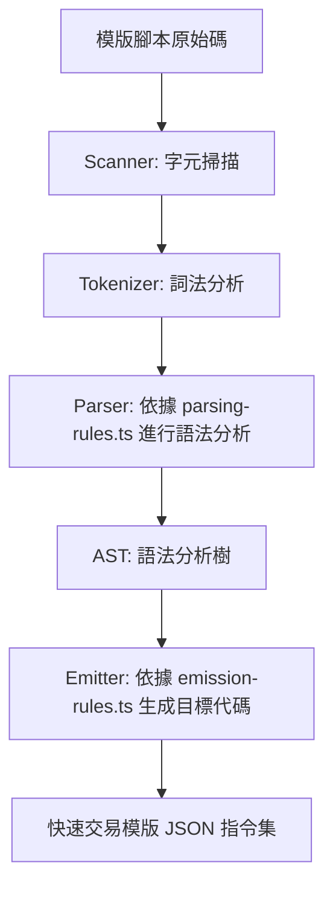

# 模版腳本轉譯器 (Template Script Transpiler)

這個專案是一個使用 TypeScript 編寫的模版腳本語言轉譯器。它能將高階的模版腳本語言 (Template Script Language) 原始碼轉譯為對應的 快速交易模版 (Quick Transaction Template) JSON 指令集，以供後續系統解析與執行。

## 相關文件

- 語法規範與轉譯對應：詳見 [模版腳本語言設計規範](./template-script-language.md)
- 目標 JSON 指令集架構：詳見 [快速交易模版規格說明](./templates.md)

## 專案架構

本專案的核心模組位於 `src/` 中，結構設計高度模組化且職責分明：

```
src/
├── core/                   # 轉譯器底層核心邏輯 (與具體語言語法無關)
│   ├── scanner.ts          # 字元掃描器
│   ├── tokenizer.ts        # 詞法分析器
│   ├── parser.ts           # 語法分析器
│   ├── token.ts            # Token 定義與比對器
│   ├── context.ts          # 編譯上下文處理診斷與錯誤定位
│   ├── symbol-table.ts     # 符號表處理作用域與變數解析
│   └── emitter.ts          # 程式碼產生器底層類別 
│
├── utils/                  # 輔助工具
│   ├── peekable.ts         # 可預讀的疊代器
│   ├── literals.ts         # 字面量解析工具
│   └── iterables.ts        # 疊代器輔助函式
│
├── tokens.ts               # 定義本語言的詞法 Token 類型與關鍵字
├── patterns.ts             # 定義本語言詞法 Token 的正規表達式、比對規則
├── parsing-tree.ts         # 定義本語言抽象語法樹節點
├── parsing-rules.ts        # 定義本語言的語法分析規則
├── symbols.ts              # 定義內建符號、函式及變數作用域
├── emission-rules.ts       # 定義本語言的程式碼產生、轉譯規則
├── index.ts                # 轉譯器主入口
└── *.test.ts               # 單元測試檔
```

## 轉譯流程

本轉譯器遵循經典的編譯器前端設計流程：



1. Scanner & Tokenizer：逐字讀取原始碼，根據 `patterns.ts` 將其切分為有意義的 Token（例如 `Identifier`, `Number`, `Amount`, `Keyword` 等）。
2. Parser：使用狀態導向的解析器配合 `parsing-rules.ts` 中定義的語法規則，將 Token 流構建成抽象語法樹（AST / `ParsingNode`）。
3. Symbol Resolver：在解析過程中，利用 `symbols.ts` 與 `SymbolTable` 追蹤變數和內建函式的宣告與呼叫合法性。
4. Emitter：走訪整個 AST，利用 `emission-rules.ts` 定義的規則與底層 `emitter.ts`，將每個節點轉譯為對應的 JSON 指令對象，最後輸出轉譯後的 JSON 字串與編譯診斷資訊（Diagnostics）。

---

## 快速開始

### 安裝依賴

本專案使用 `pnpm` 進行套件管理。請先確保已安裝 `pnpm`：

```bash
pnpm install
```

### 執行測試

我們使用 [Vitest](https://vitest.dev/) 作為測試框架，您可以執行以下命令來執行所有測試案例：

```bash
pnpm test
```

### API 使用範例

您可以直接導入 `compile` 函式來轉譯腳本：

```typescript
import { compile } from "./src/index";

const source = `
    template purchaseTemplate(
        amount = $100,
        item = "Apple"
    ) do {
        log("action": "purchase", "item": item, "price": amount);
    }
`;

const { result, diagnostics } = compile(source);

if (diagnostics.length > 0) {
    console.error("編譯出錯：", diagnostics);
} else {
    console.log("轉譯結果 JSON：");
    console.log(JSON.stringify(JSON.parse(result), null, 2));
}
```

---

## 支援的語言特性

* 自訂字面量：
  * 金額字面量：`$10_000.25`
  * ISO 8601 時間點：`@2000-01-01T00:00:00.0000`
  * ISO 8601 時間差：`@p5dt2s`
  * 底線數值分隔符：`10_000_000`
* 物件建立：
  * `{{ "key": "value" }}` (獨立 `$pack` 物件)
  * `new ColBoolean { "target": "is_active" }` (表單欄位物件)
* 控制流：
  * `if-then-else` 表達式
  * `for` 與 `while` 迴圈
  * `return` 表達式
* 變數操作：
  * 作用域管理與取值/賦值支援
